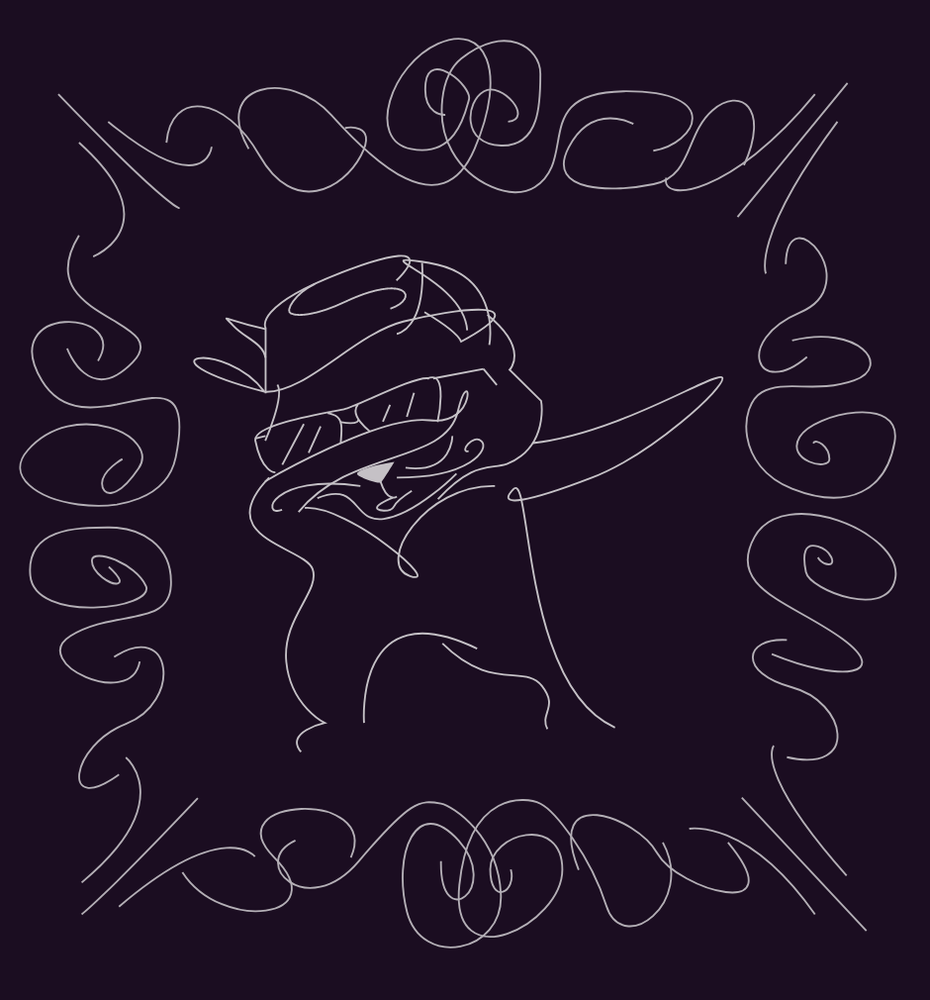

# dabnet
Posenet based Dab detector

## Design
Dabnet is composed of:
- posenet container - Posenet with a flask server to predict joint keypoints
- dabnet containers - Random Forest Model with a flask server to predict `dab` or `not dab`
- capture client - uses opencv to capture images & sends them for prediction

## Setup
1. Install docker & docker-compose
2. `docker-compose pull` for pre built docker images or `docker-compose build` to build them yourself
3. `docker-compose up`
4. Install pip dependencies for capture cleitn `pip install -r requirements.txt`
5. Run capture client `python src/capture.py`

